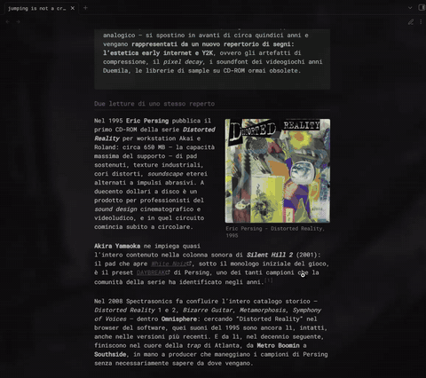

# mi·ɽài://audiovisual — TERMINAL

Personal website & portfolio of **Simo Liguori** — multimedia · idm · glitch · real-time systems.

🌐 **Live:** [eccerobot.xyz](https://eccerobot.xyz)

<p align="center">
  
</p>

## About

An interactive, glitch-driven audiovisual terminal experience — real-time systems, generative visuals, and IDM-flavored sound design. There's a hidden easter egg in there too (try the Konami code 👀).

## Stack

Hand-written HTML / CSS / JavaScript, the Web Audio API, and canvas-based real-time rendering. No framework — just the platform.

## Local development

It's a static site. Clone and serve the folder:

```bash
git clone https://github.com/simoliguori/simoliguori.git
cd simoliguori
python -m http.server 8000   # then open http://localhost:8000
```

---

© Simo Liguori · [eccerobot.xyz](https://eccerobot.xyz)
